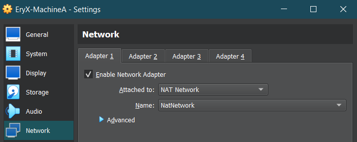
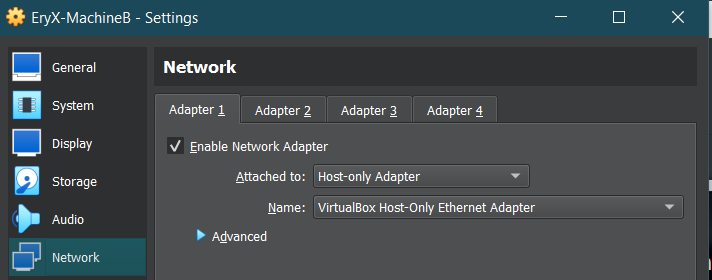

# Session 1 Answer

## Tasks 1-4

I'm using ubuntu server 22.04.03 LTS for this task.
the first thing that I did was to create two virtual machines in virtual box.

Machine A with 2 interfaces, one NAT (for internet access), and one with host-only network

Machine B with 1 network interface, host-only network
here's how:





now we add static ip addresses to the host-only network interfaces on both machines.

192.168.2.2 for Machine-A and 192.168.2.3 for Machine-B, and 192.168.2.4 for my host(physical computer), I used the netplan configuration provided in the current folder for each machine

then I added this line in /etc/sysctl.conf on Machine-A: (to enable ipv4 routing between different network interfaces)

```sh
net.ipv4.ip_forward=1
```

and then applied it using "```sudo sysctl -p /etc/sysctl.conf```"

then I ran this command on Machine-A (enp0s3 is the name of the nat interface with internet access):

```sh
sudo iptables -t nat -A POSTROUTING -o enp0s3 -j MASQUERADE
```

**now the task is completely done. (except that our iptable rulings aren't persistent).**

## Task 5 (setup proxy or VPN)

we are going to use ssh-tunnel for this task

here's the commands we're using :

```bash
ssh -fND 1080 user@ip
export https_proxy=127.0.0.1:1080
export http_proxy=127.0.0.1:1080
```

then added the line below to this configuration file /etc/apt/apt.conf:

```sh
Acquire::http::Proxy "http://127.0.0.1:1080";
```

and now apt can use the http proxy that is running in the background by ssh-tunnel.

### all done ✔
