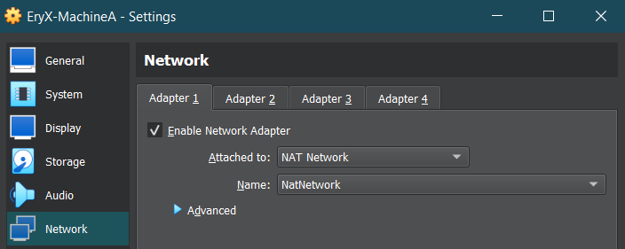
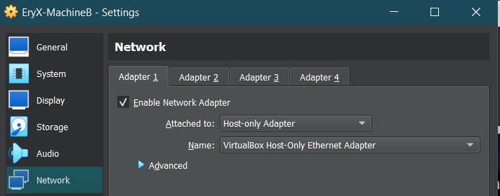

# Task 1 Answer

I'm using ubuntu server 22.04.03 LTS for this task.
the first thing that I did was to create two virtual machines in virtual box.

Machine A with 2 interfaces, one NAT (for internet access), and one with host-only network

Machine B with 1 network interface, host-only network
here's how:





now we add static ip addresses to the host-only network interfaces on both machines.

192.168.2.2 for Machine-A and 192.168.2.3 for Machine-B, and 192.168.2.4 for my host(physical computer), I used the netplan configuration provided in the current folder for each machine

then I added this line in /etc/sysctl.conf on Machine-A: (to enable ipv4 routing between different network interfaces)

```net.ipv4.ip_forward=1```

and then applied it using "```sudo sysctl -p /etc/sysctl.conf```"

then I ran this command on Machine-A (enp0s3 is the name of the nat interface with internet access):

```sudo iptables -t nat -A POSTROUTING -o enp0s3 -j MASQUERADE```
