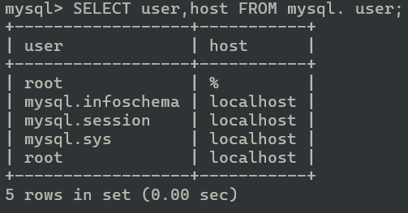

# Session 3 Answer - Part 2

## SQL Master/Slave replication

the task brief for the second part of session3 was to:

```md
1. Setup a single MySQL/MariaDB node without any configurations (default configuration). Secure it so you could only be able to connect to it by authentication (root user MUST only be able to connect to it from localhost). Create some databases and within these databases, create some tables and then insert some data in these tables (Play with it).

2. Now lets create a slave node. you need to set some configuration for your master (read where you can put your configurations and what is the best way to do so to make it easy to eyes for read).

3. In which way you desire, corrupt your master node and then change your slave to be act as new master node and then recover your old master node and set it up to be your new slave (switch master & slave roles between your 2 nodes).

4. Now let's use what we did in last task and create a slave for our wordpress service and do as described in section 3 of this task, on this service.
```

we create the docker container from the image with this command (we run this command in a folder where our config.cnf exists, also we changed the name changes for each node):

```sh
docker run --volume /root/mysql-conf/config.cnf:/etc/mysql/conf.d/config.cnf --name mysql-master -p 3306:3306 -e MYSQL_ROOT_PASSWORD=simplepass -d mysql
```

then we configure the mysql configuration file located in ```/etc/mysql/conf.d/config.cfg```, (ps: note that as you can see log_bin and unique server-id should be enabled to enable master/slave replication):

```cnf
[mysqld]
server-id = 1   #the server id number is different for each node
bind-address = 0.0.0.0
log_bin
```

now lets get into the mysql server we created with this command :

```sh
docker exec -it mysql-master mysql -u root -p"simplepass"
```

so I figured out that MySQL creates a two root users with same name but one is accessible only by localhost and one is accessible by anywhere (0.0.0.0).



so we procced to drop the root user which could be accessed by anywhere, and wrote this query in the database (master sv):

```SQL
DROP USER 'root'@'%';
```

then we go on and create some data in the database:

```SQL
CREATE DATABASE eryxTest;
USE eryxTest;
CREATE TABLE userInfo(user_id int, username text);
INSERT INTO userInfo(user_id, username) VALUES(1,'mamad'),(2,'ali');
```

then we create a slave user with this command:

```SQL
CREATE USER 'slave'@'%' IDENTIFIED BY 'slave_pass';
```

and then grant permission for the replication to the slave:

```SQL
GRANT REPLICATION SLAVE ON *.* TO 'slave'@'%';
```

then we have to lock out the database and save all the changes to the disk before transferring data to the slave (making the data consistent):

```SQL
FLUSH PRIVILEGES;
FLUSH TABLES WITH READ LOCK;
```

now we have to get in the shell again and dump the database into a single file to transfer to the slave, we do this by this command:

```sh
docker exec -it mysql-master /bin/bash;
mysqldump -u root -p"simplepass" --all-databases --master-data > dbdump.db;
docker cp mysql-master:/dbdump.db ./;
```

now we copy database dump to our slave server using this scp (or whatever).
and then apply these queries in the slave node, (line 5 is because of new caching_sha2_password algorithm used for authentication in mysql 8.0)

next, we need to know the master's bin log file and its position,
we should execute this QUERY (```SHOW MASTER STATUS\G```) in the mysql master node to get "SOURCE_LOG_FILE" and "SOURCE_LOG_POS"

and then in the slave node, we execute this query :

```sql
CHANGE MASTER TO
MASTER_HOST='YOUR_MASTER_IP',
MASTER_USER='slave',
MASTER_PASSWORD='slave_pass',
GET_MASTER_PUBLIC_KEY=1,
SOURCE_LOG_FILE='YOUR_MASTER_LOG_FILE',
SOURCE_LOG_POS=YOUR_MASTER_LOG_POS;
```

(p.s: LOG_POS is a number)

then we load the dumped data in from bash or shell in the slave node:

```sh
mysql -uroot -p'simplepass' < dbdump.db;
```

then we login to Master node's MYSQL again and hit this query in and done.

```sql
START SLAVE;
```

as for pt3 and pt4, for replicating wordpress, its exactly the same steps but we use Docker compose to handle mysql variables, etc, the compose file is [located here](https://github.com/EryX0/diginext-answers/blob/main/Session3/part2/mysql-conf-master/compose.yaml)...

